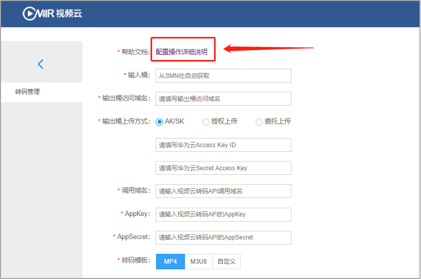
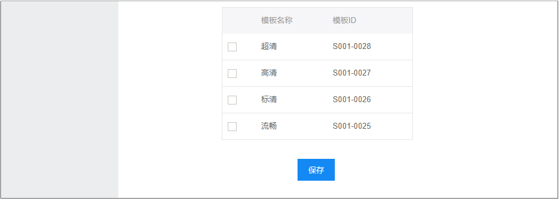
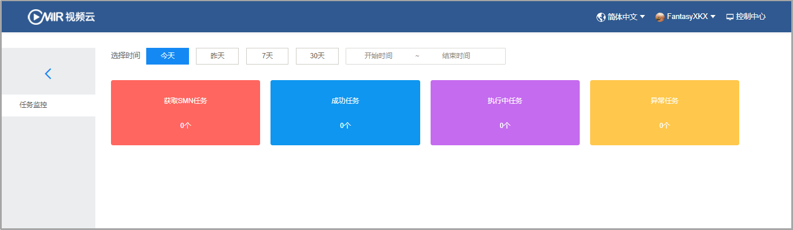

# 7.2API服务控制台

 

​	图3-7-2-1 API服务控制台

转码API服务控制台中可进行转码管理与任务监控：

#### **转码管理**

点击“立即进入”，进行转码管理

 

 

​	图 3-7-2-2 转码管理

配置操作与详细说明，您可以通过点击红色框选部分进行查看。

配置完成后，点击保存即可。

#### **任务监控**

点击“任务监控”，进入各项任务进程查看

 

​	图 3-7-2-3 任务监控

支持时间选择，对任务进行监控查看，包含获取的SMN任务数、成功与执行中任务数、异常任务数等。