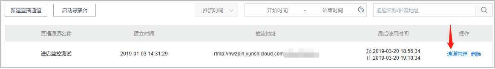
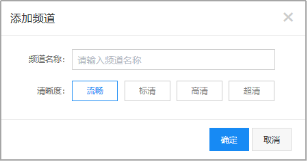
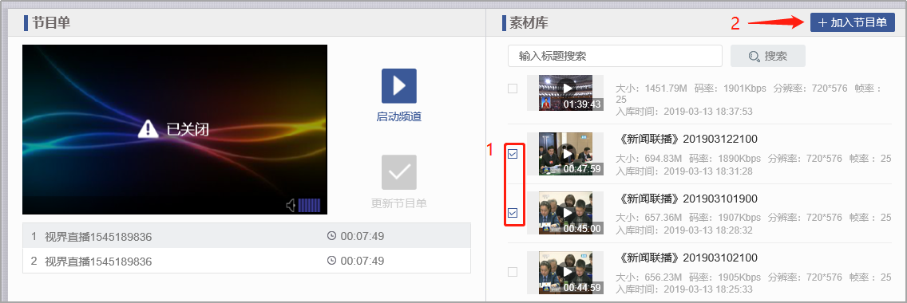
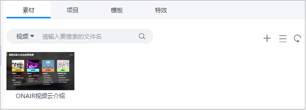
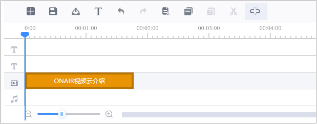
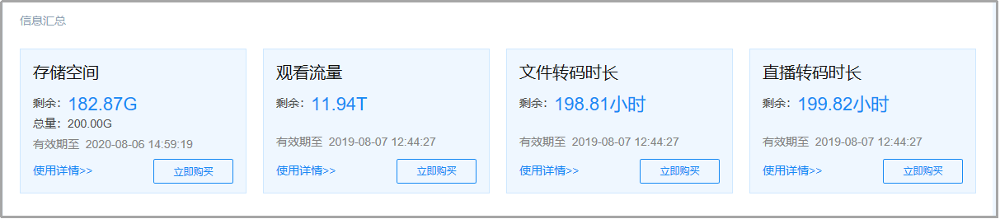
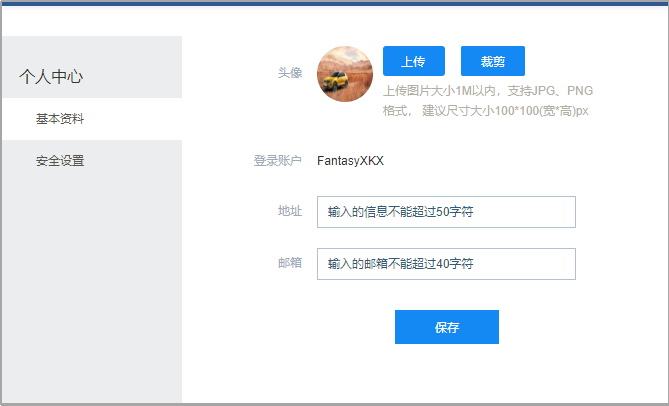

# 三．    功能详情

## 1. 注册登录

- 进入ONAIR视频云平台（https://onair.yunshicloud.com）
- 点击“立即体验”，进入登录页面。

### 1.1用户注册

- 点击“立即注册”，填写注册信息，完成注册进入ONAIR视频云平台。

图3-1-1-1 用户注册  

​	图3-1-1-2 注册页面

### 1.2用户登录

- 填写用户名或手机号、登录密码，进入ONAIR视频云平台。

​	图3-1-1-3 用户登录

## 2. 直播管理

#### 2.1 新建通道

- 选择“直播管理”，点击“新建直播通道”，输入通道名，完成通道创建。

​						图3-2-1-1 新建直播通道

​				图3-2-1-2 通道命名

### 2.2获取推流地址

- 点击右侧的“通道管理”按钮，进入通道管理页面；

图3-2-2-1 通道管理

#### **推流直播**

- 在通道管理界面，获取推流地址，将推流地址设置到您的推流设备，开始推流； 

​						图3-2-2-2 获取推流地址

#### **拉流直播**

- 若您需要创建的是一场拉流直播，将源流地址粘贴到“拉流地址”框，点击“启动”按钮；

注：拉流、推流操作不可同时进行（同一通道内）

​							图3-2-2-3 设置拉流地址

#### **手机直播**

- 进入直播通道，点击下方的“手机推流”按钮，获取“视界直播”APP下载链接，安装“视界直播”APP。同时获取APP授权码；

​							图3-2-2-4 获取手机APP下载地址

注：使用iOS系统安装APP时，需进行APP信任设置：

进入设置→通用→设备管理→点击“ZhengQi(Beijing)Video technology Co., Ltd”→点击“信任”。

- 进入“视界直播”APP，点击左上角的“设置”按钮，输入APP授权码，设置直播清晰度；

​	图3-2-2-5 输入APP授权码，设置直播清晰度

- 通过左侧工具栏，可设置直播摄像头（前置/后置）、是否开启闪光灯及美颜；

  

  ​	图3-2-2-7 开启手机直播

- 推流成功后，可在监看播放器预览您的直播画面。

​	图3-2-2-8 直播画面监看

### 2.3获取播放地址

- 在“通道管理”下方，可获取您当前直播通道的播放地址；

​				图3-2-3-1 获取播放地址

- 点击“播放”按钮，预览直播画面。

  

  ​	图3-2-3-2预览直播画面

### 2.4设置直播转码

- 进入“直播转码”标签，选择您需要输出的清晰度，点击右侧的“启动转码”，即可获取多分辨率播放地址。

 

​	图3-2-4-1 设置直播转码

 

​	图3-2-4-2 开启直播转码

- 直播结束后，点击“结束转码”关闭直播转码。

### 2.5开启直播水印

- 进入“通道管理”标签，开启水印按钮，并选择水印。

 

​	图3-2-5-1 开启直播水印

 

​	图3-2-5-2 选择直播水印

### 2.6获取播放器代码

- 进入“Web播放器代码”标签，即可获取对应的网页及移动端播放器代码。

 

​	图3-2-6-1 获取播放器代码

### 2.7开启导播

- 点击“启动导播台”，进入与导播操作界面；

 

​	图3-2-7-1 进入导播

**导播配置**

- 输入设置：可选择已有的直播通道地址、文件地址（必须为已启用的文件地址），或自定义地址。如图示，机位1必填项。点击“预览”，即可在下方对应机位窗口预览画面。

 

​	图3-2-7-2 输入设置

- 输出设置：输入导播台的输出地址，选择所需要的输出的清晰度（流畅、标清、高清、超清），同时支持推送第三方直播平台，开启“推送平台”，选择输出地址即可，完成后点击“保存导播台”；

 

​	图3-2-7-3 输出设置

- 完成输入、输出地址设置后，保存导播台，点击“开始输出”，即可开始输出导播画面。

 

​	图3-2-7-4 开启导播台

**直播过程中，可实时添加角标、字幕** 

- 角标设置：导播过程中，选择“角标设置”标签，可添加角标图片。

 

​	图3-2-7-5 添加、设置角标

- 字幕设置：选择“字幕设置”标签，可添加字幕。支持字幕名称定义，字号大小、颜色、字幕位置、显示方式调整（静态、滚动）。

​							 

​	图3-2-7-6 添加、设置字幕

- 直播结束后，点击右上角的“停止输出”按钮，结束导播输出。

-  

  ​	图3-2-7-7 停止导播输出

## 3.    轮播管理

- 进入“轮播管理”，点击“添加频道”，设置频道名称和输出清晰度。

 

​	图3-3-1-1 创建轮播频道

- 点击右侧“详情”按钮，进入轮播控制台，勾选素材库中的文件，点击加入节目单，并调整节目单播放顺序。

 

​	图3-3-1-2 编辑节目单

- 点击“启动频道”按钮，开始轮播输出。

 

​	图3-3-1-3 开始轮播输出

- 返回“轮播管理”页面，获取播放地址。

 

​	图3-3-1-4 获取播放地址

- 直播结束后，点击“停止频道”按钮，关闭轮播频道输出。

 

​	图3-3-1-5 停止频道输出

## 4.   内容管理

### 4.1文件上传

- 进入“内容管理”，点击“上传”按钮，将文件拖拽到上传区域，完成上传;
- 支持多种文件格式上传，支持并发上传、断点续传。

 

​	图3-4-1-1 文件上传

 

​	图3-4-1-2 上传完成

### 4.2文件管理

- 选择需要进行操作的素材，点击“详情”按钮；

 

​	图3-4-2-1 文件管理

- 进入文件管理页面，修改文件名称、描述、封面图等基础信息；

 

​	图3-4-2-2 修改文件基础信息

- 在“视频地址”标签，获取多清晰度视频地址，并可下载视频。

 

​	图3-4-2-3 获取视频地址、下载视频

### 4.3文件禁用/启用

- 点击文件右侧的“禁用/启用”按钮，即可禁用/启用文件，如果文件处于禁用状态，则不可播放/使用。

 

图3-4-3-1 文件禁用/启用

### 4.4文件删除

- 点击文件内容右侧的“删除”按钮，可对文件内容进行逐条删除；

同时支持勾选多条文件，进行批量删除。

 

​	图3-4-4-1逐条删除文件

 

​	图3-4-4-2 批量删除文件

### 4.5视频剪辑

- 勾选需要进行编辑的素材内容，点击上方的“剪辑”按钮进入快编；

 

​	图3-4-5-1 视频剪辑

- 素材、项目、模板、特效选择区：添加素材，选择已保存的项目、模板、特效。

 

​	图3-4-5-2 视频快编1

- 快编操作区域：将快编文件与字幕等放置于相关编辑位置，编辑轨上方为操作按钮：依次为新建、保存、发布、添加字幕、撤销、重做、剪切、复制、粘贴、切分、自动吸附。

 

​	图3-4-5-3 视频快编2

- 右侧为实时预览快编效果，支持键盘方向键控制播放（按每帧），空格暂停等快捷操作；
   

​	图3-4-5-4 预览

- 点击“素材”按钮，选择/添加素材文件

 

​	图3-4-5-5 选择/添加素材

- 选择/创建快编模板，设定完成后，单击“确定”按钮，完成转码标题模板的创建；

 

​	图3-4-5-6 新建模板

- 特效添加：可在视频不同位置添加，相同或不同的特效效果；

 

​	图3-4-5-7 特效选择

- 在不同轨道添加字幕与音频信息，完成快编任务；

 

​	图3-4-5-8 视频剪辑

- 快编完成后，点击“发布”按钮，完成输出设置，点击“确定”按钮，快编后的视频文件即可保存在内容库内；

 

​	图3-4-5-9 输出设置

### 4.6文件转码

- 勾选需要转码的文件内容，点击上方“转码”按钮，选择转码模板组和水印文件，进行文件转码；

 

​	图3-4-6-1 添加转码

- 进入“转码任务”，可查看当前转码任务的状态。

 

​	图3-4-6-2 转码任务查询 

### 4.7文件检测

- 勾选素材文件，点击“检测”按钮，添加检测任务。

 

​	图3-4-7-1 添加检测任务 

- 选择检测维度，点击“确定”按钮。

 

​	图3-4-7-2 选择检测维度

- 进入“检测任务”页签，查看检测任务状态。

 

​	图3-4-7-3 查看检测任务

- 点击详情，查看检测结果。

 

​	图3-4-7-4 查看检测结果

### 4.8视频打点

- 选择需要打点的视频内容，进入内容详情。播放视频，点击“打点”按钮，填写打点信息。

 

​	图3-4-8-1 添加打点

- 在右侧可查看所有打点信息，并可进行打点删除。

 

​	图3-4-8-2 打点管理

## 5.   发布管理

### 5.1新建发布

- 进入发布管理页面，点击“新建发布”按钮；

 

​	图3-5-1-1 新建发布

- 选择发布模板；

 

​	图3-5-1-2 选择模板

#### **简约模板：**

适用于单条内容发布，上方为播放窗，下方为简介和评论。

 

​	图3-5-1-3 简约模板

输入发布名称，选择观看限制，确定播放类型（点播或直播），添加内容源（云媒体库中已发布的素材和建立的直播通道），上传缩略图，编写内容简介，点击“预览发布”。

 

​	图3-5-1-4 预览发布

确认无误后，点击“确认发布”，完成简约模板的内容发布。

#### **列表模板：**

适用于多条内容发布，上方为主播放窗，下方为内容列表。

 

​	图3-5-1-5 列表模板

信息填写完成后，点击“预览发布”，完成页面发布（同简约模板发布操作步骤）。

##### **公开课1：**

满足多种教育场景需求，可快速创建一对多课堂教学；

同时可进行课件内容展示与直播同步，让课堂教学变得简单易行，实时评论让课堂沟通更及时，反馈问题更精准，达到在线公开课的授课目的。

 

​	图 3-5-1-6 公开课1

信息填写完成后，点击“预览发布”，完成页面发布（同简约模板发布操作步骤）。

##### **公开课2：**

迅速搭建工作会议、业务培训、远程协助等工作；

开展企业技能培训，远程视频协同。

 

​	图 3-5-1-7 公开课2

信息填写完成后，点击“预览发布”，完成页面发布（同简约模板发布操作步骤）。

### 5. 2   发布管理

对已完成发布的信息进行管理，点击“管理”，进入信息编辑页面；

 

​	图3-5-2-1 发布管理1

信息编辑完成，点击“确认修改”按钮，完成修改。

 

​	图 3-5-2-2 发布管理2

### 5.3互动管理

在发布预览过程中，可实时进行互动评论等活动，评论显示在右侧展示框内：

 

​	图 3-5-3-1 互动管理

### 5.4删除发布

- 点击发布页面右侧的“删除”按钮，可进行逐条删除；

同时支持勾选多条发布页面，进行批量删除。

## 6.    统计分析

### 6.1资源用量

同于统计直播流量、点播流量和存储资源用量，支持按时间范围进行查询。

 

​	图3-6-1-1 资源用量-直播

 

​	图3-6-1-2 资源用量-存储

### 6.2业务数据

用于统计平台文件数、发布数、以及直播通道数，支持按时间范围进行查询。

 

​	图3-6-2-1 业务数据统计	

### 6.3观看数据

用于统计直播、点播、发布页面的观看数据，包含用户数（UV）和观看数（PV）；支持概览查看。

- 直播

 

​	图3-6-3-1 直播观看数据

- 点播

 

图3-6-3-2 点播观看数据

- 发布页面

 

​	图3-6-3-3 发布页面数据

- 观看地域

 

​	图3-6-3-4 观看地域分布

## 7.    控制中心

### 7.1信息汇总

 

​	图 3-7-1-1 信息汇总

汇总展示当前账户的资源使用情况。

#### **使用详情**

 

图 3-7-1-2 使用详情

 

​	图 3-7-1-3 详情

不同资源对应不同的详情类型，您可以点击相应的资源进行查看。

#### **立即购买**

 

​	图 3-7-1-4 立即购买

点击“立即购买”，可跳转至于个人中心相同的购买页面进行资源包与套餐购买。

### 7.2API服务控制台

 

​	图3-7-2-1 API服务控制台

转码API服务控制台中可进行转码管理与任务监控：

#### **转码管理**

点击“立即进入”，进行转码管理

 

 

​	图 3-7-2-2 转码管理

配置操作与详细说明，您可以通过点击红色框选部分进行查看。

配置完成后，点击保存即可。

#### **任务监控**

点击“任务监控”，进入各项任务进程查看

 

​	图 3-7-2-3 任务监控

支持时间选择，对任务进行监控查看，包含获取的SMN任务数、成功与执行中任务数、异常任务数等。

### 7.3水印管理

 

​	图3-7-3-1 水印管理

针对直播或内容库中素材，使得转码后直播或视频素材获得水印。

​	图3-7-3-2 添加水印

- 上传完毕，单击“确定”，完成水印添加。

## 8.    用户中心

### 8.1个人中心

 

​	图 3-8-1-1 个人中心

提供当前登录用户资料修改与安全设置：

- 基本资料

 

​	图 3-8-1-2 基本资料

支持当前登录用户头像上传与裁剪，确认当前用户的地址与邮箱合理有效。

 

​	图 3-8-1-3 头像裁剪

- 安全设置

 

​	图 3-8-1-4 安全设置

输入原密码，并确认新密码设定，完成后保存。

### 8.2服务购买

- 购买

 

​	图 3-8-2-1 服务购买

点击“服务购买”，显示当前系统提供的资源包与套餐服务，同时可点击“立即购买”，进行购买。

 

​	图 3-8-2-2 立即购买

可跳转至支付页面，进行支付购买：

 

​	图 3-8-2-3 立即支付

- 订单详情

 

​	图 3-8-2-4 订单详情

可查看当前购买资源的详情，也可对误选资源包与套餐进行删除操作。

### 8.3退出

 

​	图 3-8-3-1 退出

点击退出，退回登录页面。

