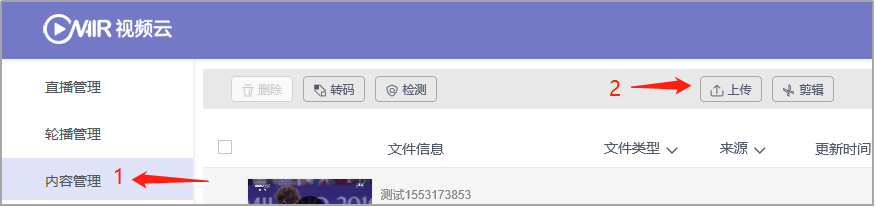
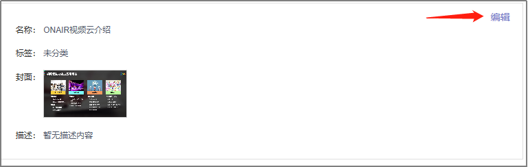
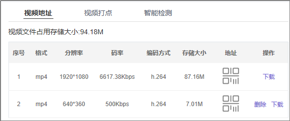
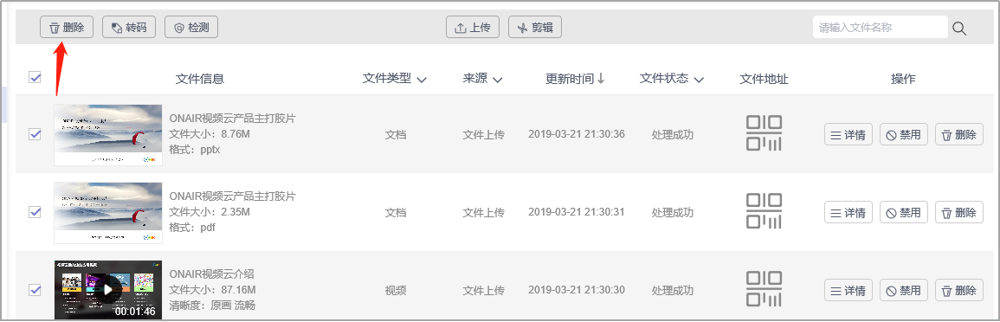
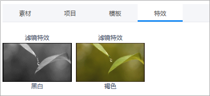
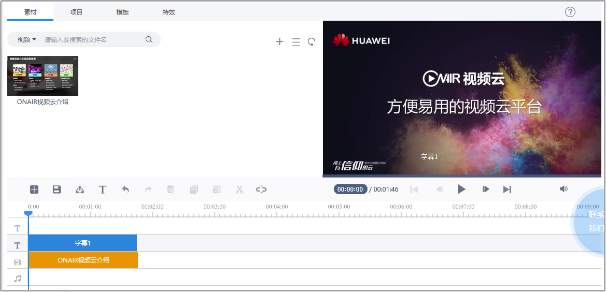
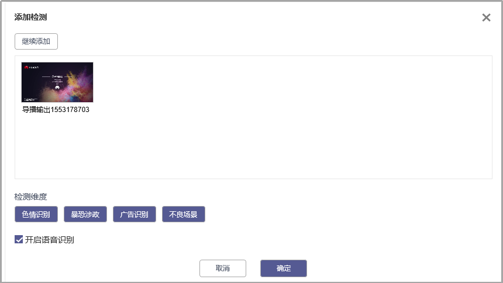
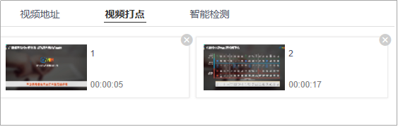

# 4.   内容管理

## 4.1文件上传

- 进入“内容管理”，点击“上传”按钮，将文件拖拽到上传区域，完成上传;
- 支持多种文件格式上传，支持并发上传、断点续传。

 

​	图3-4-1-1 文件上传

 

​	图3-4-1-2 上传完成

## 4.2文件管理

- 选择需要进行操作的素材，点击“详情”按钮；

 

​	图3-4-2-1 文件管理

- 进入文件管理页面，修改文件名称、描述、封面图等基础信息；

 

​	图3-4-2-2 修改文件基础信息

- 在“视频地址”标签，获取多清晰度视频地址，并可下载视频。

 

​	图3-4-2-3 获取视频地址、下载视频

## 4.3文件禁用-启用

- 点击文件右侧的“禁用/启用”按钮，即可禁用/启用文件，如果文件处于禁用状态，则不可播放/使用。

 

图3-4-3-1 文件禁用/启用

## 4.4文件删除

- 点击文件内容右侧的“删除”按钮，可对文件内容进行逐条删除；

同时支持勾选多条文件，进行批量删除。

 

​	图3-4-4-1逐条删除文件

 

​	图3-4-4-2 批量删除文件

## 4.5视频剪辑

- 勾选需要进行编辑的素材内容，点击上方的“剪辑”按钮进入快编；

 

​	图3-4-5-1 视频剪辑

- 素材、项目、模板、特效选择区：添加素材，选择已保存的项目、模板、特效。

 

​	图3-4-5-2 视频快编1

- 快编操作区域：将快编文件与字幕等放置于相关编辑位置，编辑轨上方为操作按钮：依次为新建、保存、发布、添加字幕、撤销、重做、剪切、复制、粘贴、切分、自动吸附。

 

​	图3-4-5-3 视频快编2

- 右侧为实时预览快编效果，支持键盘方向键控制播放（按每帧），空格暂停等快捷操作；
   

​	图3-4-5-4 预览

- 点击“素材”按钮，选择/添加素材文件

 

​	图3-4-5-5 选择/添加素材

- 选择/创建快编模板，设定完成后，单击“确定”按钮，完成转码标题模板的创建；

 

​	图3-4-5-6 新建模板

- 特效添加：可在视频不同位置添加，相同或不同的特效效果；

 

​	图3-4-5-7 特效选择

- 在不同轨道添加字幕与音频信息，完成快编任务；

 

​	图3-4-5-8 视频剪辑

- 快编完成后，点击“发布”按钮，完成输出设置，点击“确定”按钮，快编后的视频文件即可保存在内容库内；

 

​	图3-4-5-9 输出设置

## 4.6文件转码

- 勾选需要转码的文件内容，点击上方“转码”按钮，选择转码模板组和水印文件，进行文件转码；

 

​	图3-4-6-1 添加转码

- 进入“转码任务”，可查看当前转码任务的状态。

 

​	图3-4-6-2 转码任务查询 

## 4.7文件检测

- 勾选素材文件，点击“检测”按钮，添加检测任务。

 

​	图3-4-7-1 添加检测任务 

- 选择检测维度，点击“确定”按钮。

 

​	图3-4-7-2 选择检测维度

- 进入“检测任务”页签，查看检测任务状态。

 

​	图3-4-7-3 查看检测任务

- 点击详情，查看检测结果。

 

​	图3-4-7-4 查看检测结果

## 4.8视频打点

- 选择需要打点的视频内容，进入内容详情。播放视频，点击“打点”按钮，填写打点信息。

 

​	图3-4-8-1 添加打点

- 在右侧可查看所有打点信息，并可进行打点删除。

 

​	图3-4-8-2 打点管理

