# 2. 直播管理

## 2.1 新建通道

- 选择“直播管理”，点击“新建直播通道”，输入通道名，完成通道创建。

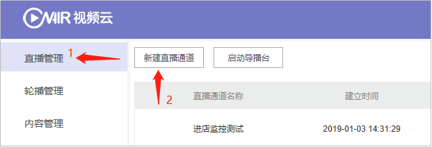

​						图3-2-1-1 新建直播通道

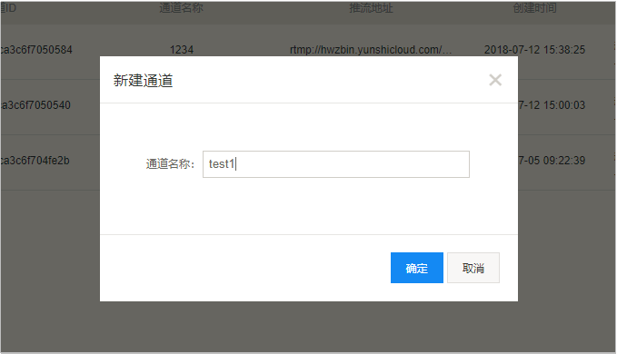

​				图3-2-1-2 通道命名

## 2.2获取推流地址

- 点击右侧的“通道管理”按钮，进入通道管理页面；

图3-2-2-1 通道管理

#### **推流直播**

- 在通道管理界面，获取推流地址，将推流地址设置到您的推流设备，开始推流； 

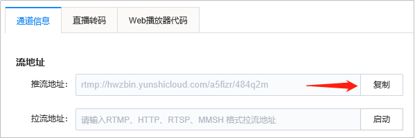

​						图3-2-2-2 获取推流地址

#### **拉流直播**

- 若您需要创建的是一场拉流直播，将源流地址粘贴到“拉流地址”框，点击“启动”按钮；

注：拉流、推流操作不可同时进行（同一通道内）

​							图3-2-2-3 设置拉流地址

#### **手机直播**

- 进入直播通道，点击下方的“手机推流”按钮，获取“视界直播”APP下载链接，安装“视界直播”APP。同时获取APP授权码；

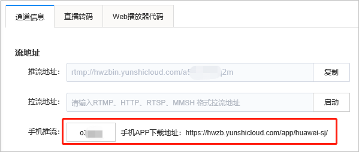

​							图3-2-2-4 获取手机APP下载地址

注：使用iOS系统安装APP时，需进行APP信任设置：

进入设置→通用→设备管理→点击“ZhengQi(Beijing)Video technology Co., Ltd”→点击“信任”。

- 进入“视界直播”APP，点击左上角的“设置”按钮，输入APP授权码，设置直播清晰度；

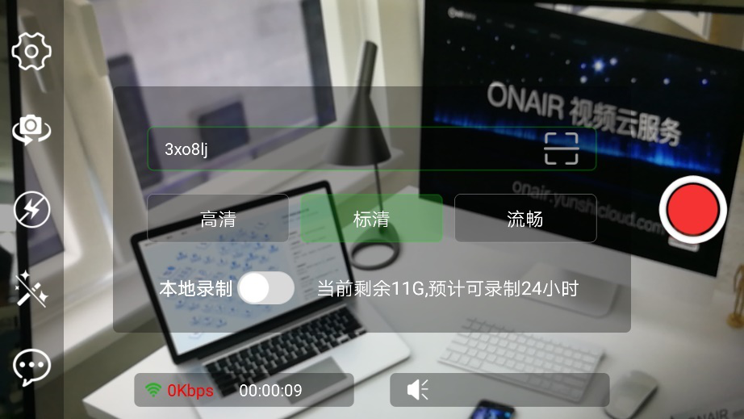

​	图3-2-2-5 输入APP授权码，设置直播清晰度

- 通过左侧工具栏，可设置直播摄像头（前置/后置）、是否开启闪光灯及美颜；

  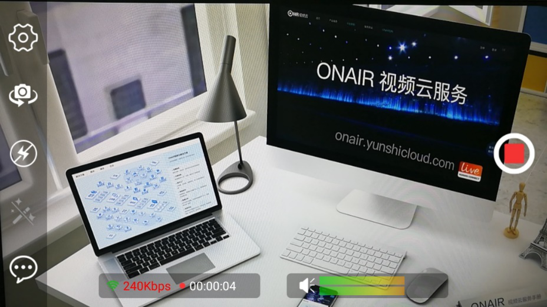

  ​	图3-2-2-7 开启手机直播

- 推流成功后，可在监看播放器预览您的直播画面。

​	图3-2-2-8 直播画面监看

## 2.3获取播放地址

- 在“通道管理”下方，可获取您当前直播通道的播放地址；

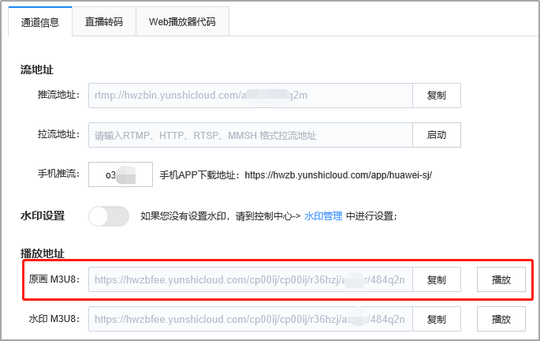

​				图3-2-3-1 获取播放地址

- 点击“播放”按钮，预览直播画面。

  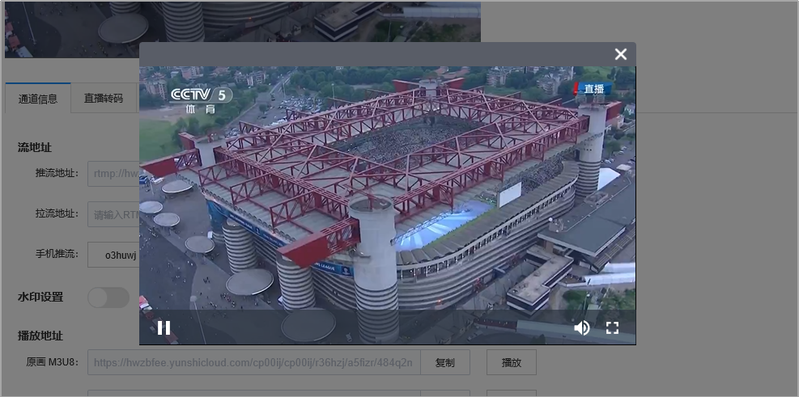

  ​	图3-2-3-2预览直播画面

## 2.4设置直播转码

- 进入“直播转码”标签，选择您需要输出的清晰度，点击右侧的“启动转码”，即可获取多分辨率播放地址。

 

​	图3-2-4-1 设置直播转码

 

​	图3-2-4-2 开启直播转码

- 直播结束后，点击“结束转码”关闭直播转码。

## 2.5开启直播水印

- 进入“通道管理”标签，开启水印按钮，并选择水印。

 

​	图3-2-5-1 开启直播水印

 

​	图3-2-5-2 选择直播水印

## 2.6获取播放器代码

- 进入“Web播放器代码”标签，即可获取对应的网页及移动端播放器代码。

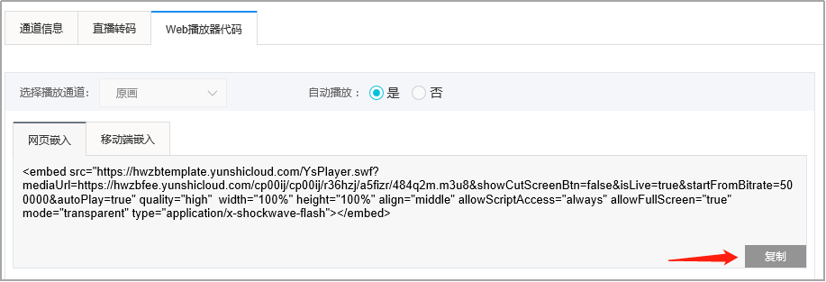 

​	图3-2-6-1 获取播放器代码

## 2.7开启导播

- 点击“启动导播台”，进入与导播操作界面；

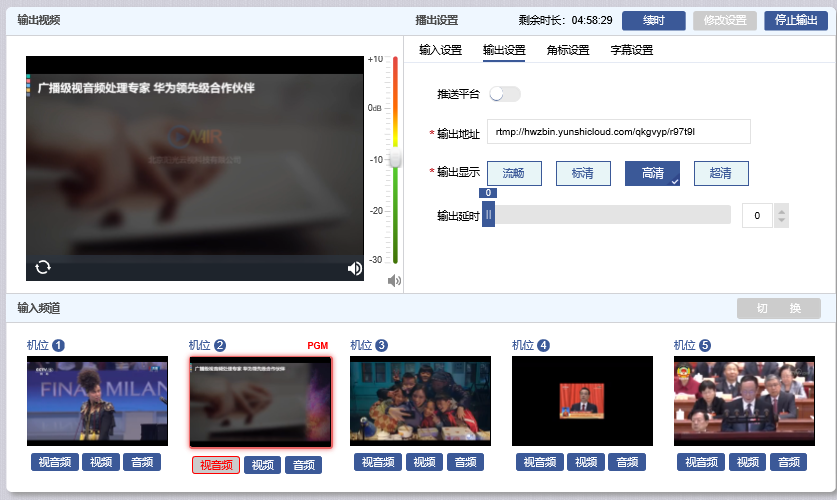 

​	图3-2-7-1 进入导播

**导播配置**

- 输入设置：可选择已有的直播通道地址、文件地址（必须为已启用的文件地址），或自定义地址。如图示，机位1必填项。点击“预览”，即可在下方对应机位窗口预览画面。

 

​	图3-2-7-2 输入设置

- 输出设置：输入导播台的输出地址，选择所需要的输出的清晰度（流畅、标清、高清、超清），同时支持推送第三方直播平台，开启“推送平台”，选择输出地址即可，完成后点击“保存导播台”；

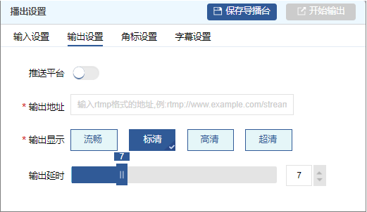 

​	图3-2-7-3 输出设置

- 完成输入、输出地址设置后，保存导播台，点击“开始输出”，即可开始输出导播画面。

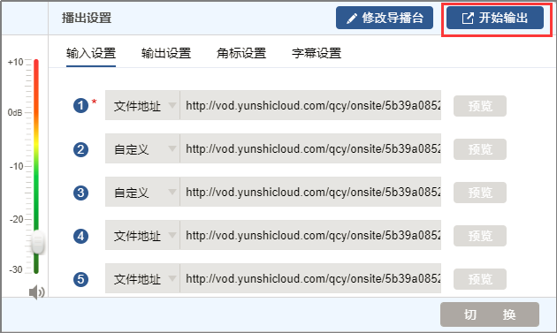 

​	图3-2-7-4 开启导播台

**直播过程中，可实时添加角标、字幕** 

- 角标设置：导播过程中，选择“角标设置”标签，可添加角标图片。

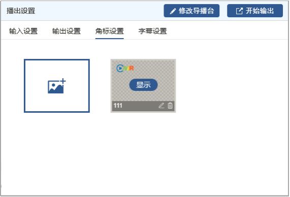 

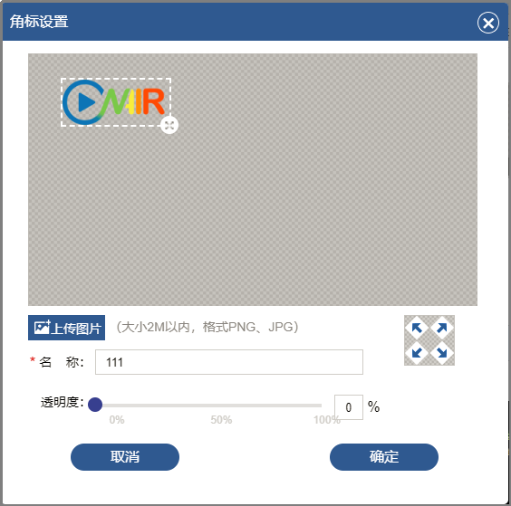

​	图3-2-7-5 添加、设置角标

- 字幕设置：选择“字幕设置”标签，可添加字幕。支持字幕名称定义，字号大小、颜色、字幕位置、显示方式调整（静态、滚动）。

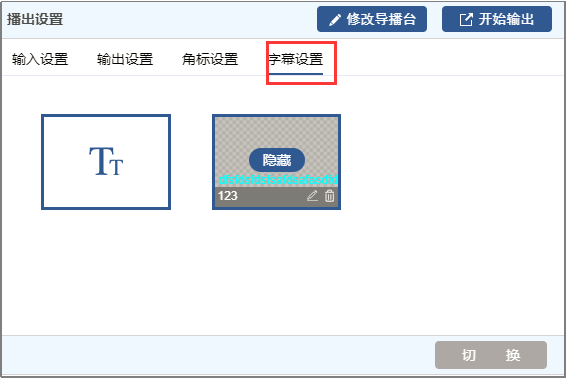

​							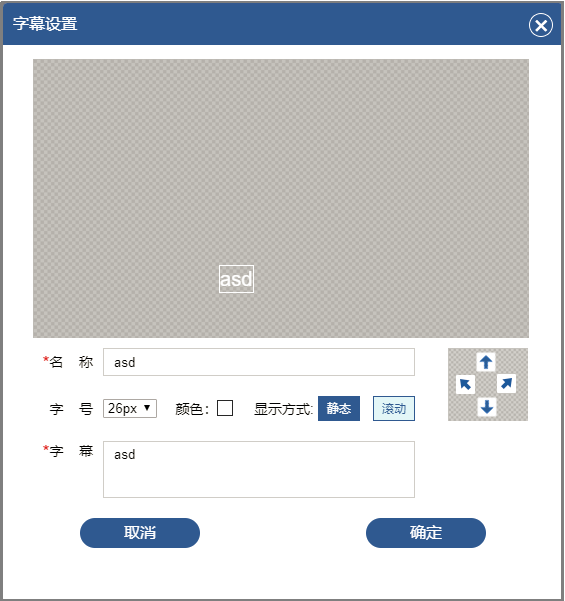 

​	图3-2-7-6 添加、设置字幕

- 直播结束后，点击右上角的“停止输出”按钮，结束导播输出。

- 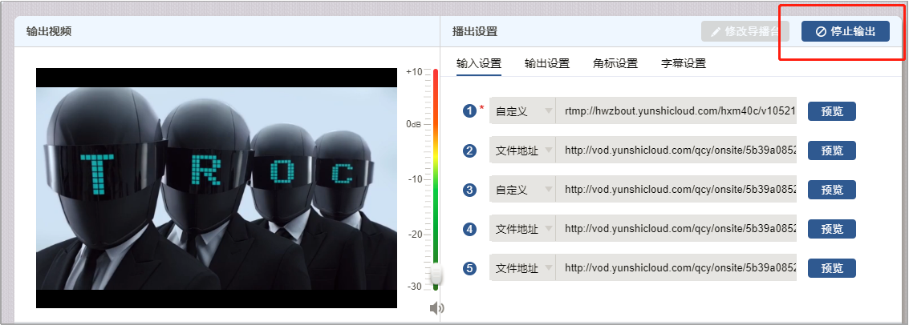 

  ​	图3-2-7-7 停止导播输出