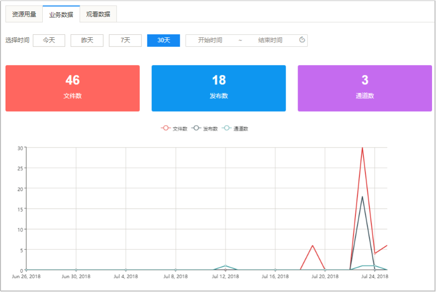
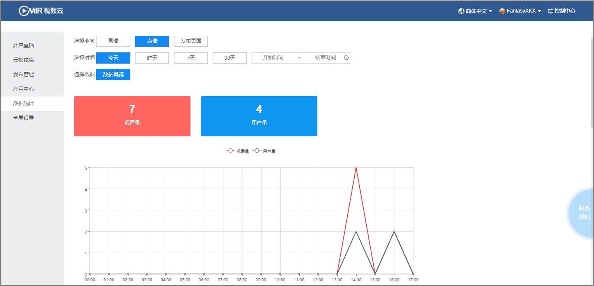

# 6.    统计分析

## 6.1资源用量

同于统计直播流量、点播流量和存储资源用量，支持按时间范围进行查询。

 

​	图3-6-1-1 资源用量-直播

 

​	图3-6-1-2 资源用量-存储

## 6.2业务数据

用于统计平台文件数、发布数、以及直播通道数，支持按时间范围进行查询。

 

​	图3-6-2-1 业务数据统计	

## 6.3观看数据

用于统计直播、点播、发布页面的观看数据，包含用户数（UV）和观看数（PV）；支持概览查看。

- 直播

 

​	图3-6-3-1 直播观看数据

- 点播

 

图3-6-3-2 点播观看数据

- 发布页面

 

​	图3-6-3-3 发布页面数据

- 观看地域

 

​	图3-6-3-4 观看地域分布