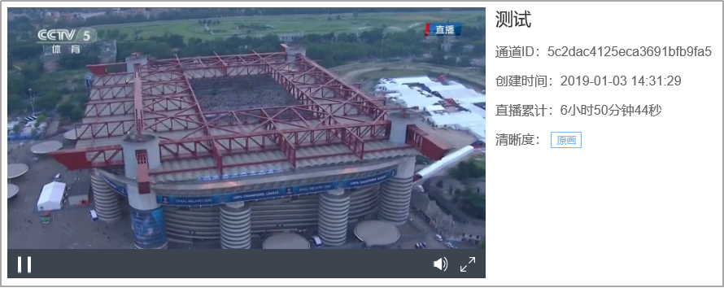

# 2.2获取推流地址

- 点击右侧的“通道管理”按钮，进入通道管理页面；

图3-2-2-1 通道管理

#### **推流直播**

- 在通道管理界面，获取推流地址，将推流地址设置到您的推流设备，开始推流； 

​						图3-2-2-2 获取推流地址

#### **拉流直播**

- 若您需要创建的是一场拉流直播，将源流地址粘贴到“拉流地址”框，点击“启动”按钮；

注：拉流、推流操作不可同时进行（同一通道内）

​							图3-2-2-3 设置拉流地址

#### **手机直播**

- 进入直播通道，点击下方的“手机推流”按钮，获取“视界直播”APP下载链接，安装“视界直播”APP。同时获取APP授权码；

​							图3-2-2-4 获取手机APP下载地址

注：使用iOS系统安装APP时，需进行APP信任设置：

进入设置→通用→设备管理→点击“ZhengQi(Beijing)Video technology Co., Ltd”→点击“信任”。

- 进入“视界直播”APP，点击左上角的“设置”按钮，输入APP授权码，设置直播清晰度；

​	图3-2-2-5 输入APP授权码，设置直播清晰度

- 通过左侧工具栏，可设置直播摄像头（前置/后置）、是否开启闪光灯及美颜；

  

  ​	图3-2-2-7 开启手机直播

- 推流成功后，可在监看播放器预览您的直播画面。

​	图3-2-2-8 直播画面监看