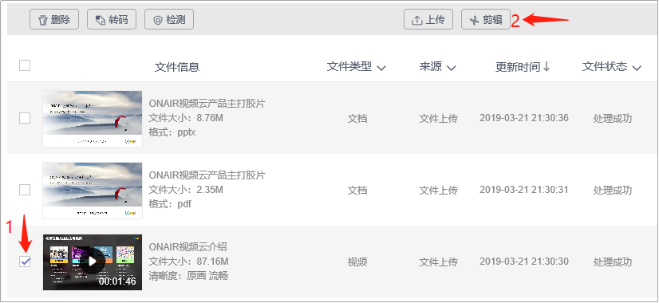
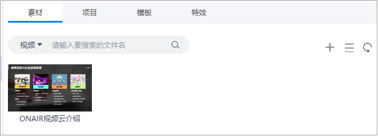
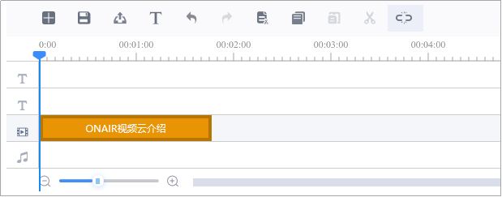
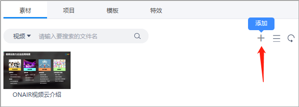
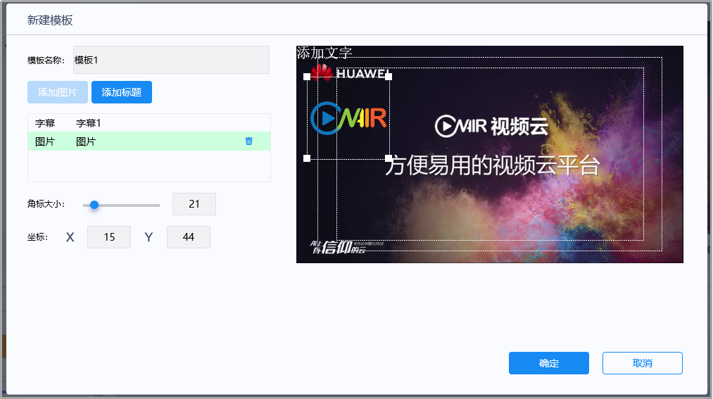
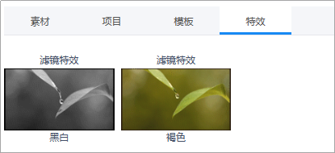
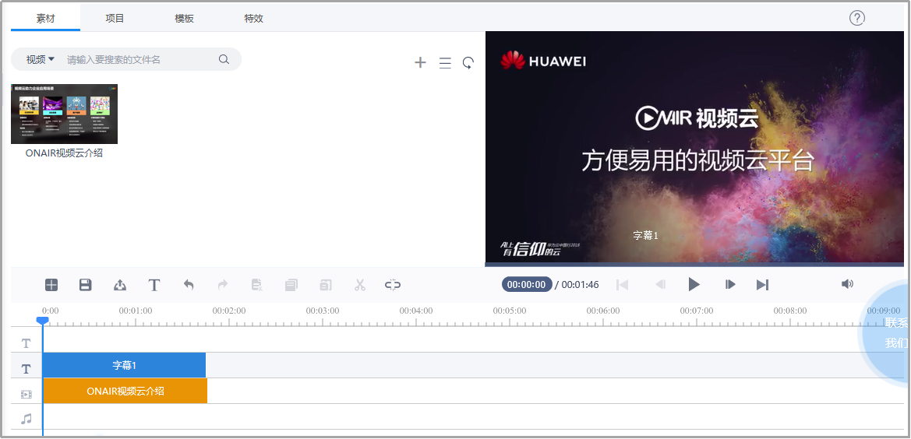
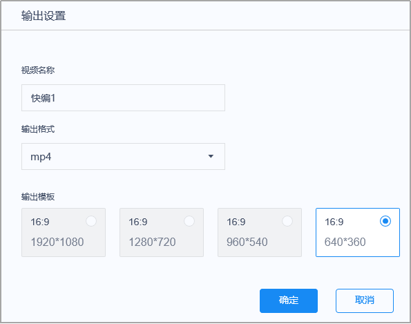

# 4.5视频剪辑

- 勾选需要进行编辑的素材内容，点击上方的“剪辑”按钮进入快编；

 

​	图3-4-5-1 视频剪辑

- 素材、项目、模板、特效选择区：添加素材，选择已保存的项目、模板、特效。

 

​	图3-4-5-2 视频快编1

- 快编操作区域：将快编文件与字幕等放置于相关编辑位置，编辑轨上方为操作按钮：依次为新建、保存、发布、添加字幕、撤销、重做、剪切、复制、粘贴、切分、自动吸附。

 

​	图3-4-5-3 视频快编2

- 右侧为实时预览快编效果，支持键盘方向键控制播放（按每帧），空格暂停等快捷操作；
   

​	图3-4-5-4 预览

- 点击“素材”按钮，选择/添加素材文件

 

​	图3-4-5-5 选择/添加素材

- 选择/创建快编模板，设定完成后，单击“确定”按钮，完成转码标题模板的创建；

 

​	图3-4-5-6 新建模板

- 特效添加：可在视频不同位置添加，相同或不同的特效效果；

 

​	图3-4-5-7 特效选择

- 在不同轨道添加字幕与音频信息，完成快编任务；

 

​	图3-4-5-8 视频剪辑

- 快编完成后，点击“发布”按钮，完成输出设置，点击“确定”按钮，快编后的视频文件即可保存在内容库内；

 

​	图3-4-5-9 输出设置